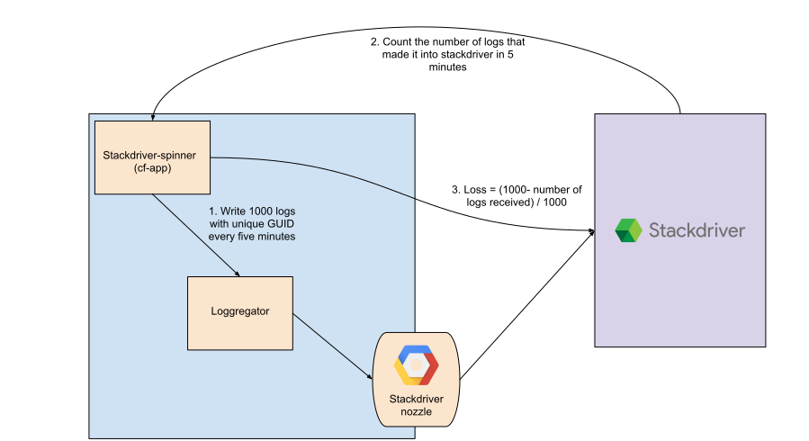

# stackdriver-spinner

stackdriver-spinner is a companion cf app to Stackdriver nozzle which is used to measure its reliability. It periodically logs a set of unique messages to loggregator and waits for them to reach Stackdriver via the nozzle. If any logs are lost in between, the loss ratio is published
to Stackdriver Logging.

## Design



1. stackdriver-spinner logs `SPINNER_COUNT` number of logs with the payload being a unique GUID. These logs will then eventually make it to Stackdriver via loggregator->Stackdriver nozzle.
1. It waits for `SPINNER_WAIT` time. This wait is to give time to nozzle to process and ship the logs to Stackdriver.
1. It then polls the Stackdriver logging API for the unique GUID and counts the number of these logs. The expectation is that logs are in Stackdriver within `SPINNER_WAIT` time.
1. It then calculates the loss by `(SPINNER_COUNT - count of received logs) / SPINNER_COUNT`
1. The loss is sent directly to Stackdriver via the logging API. This can be used to setup log based metrics and alerts.

`SPINNER_COUNT` and `SPINNER_WAIT` default to `999` and `300` seconds respectively. They
can be tweaked by editing the `manifest.yml`.

## Instructions to run stackdriver-spinner
1. Add the target GCP project in `./manifest.yml`.
1. The GCP project will need a service account with log reader and writer permissions.
1. The JSON key for this service account should be stored in `./credentials.json`.
1. Make sure that you are logged into cf and have targeted the desired org and space.
1. Push this app to target cloudfoundry by `cf push`.
1. Search for "Loss: " in the stackdriver logging platform. You should be able to see the loss measurement on a scale from 0 to 1 (1 representing complete loss of logs).

## gcloud CLI tips and tricks

* View the measurements sent to Stackdriver logging by the spinner

```
$ gcloud beta logging read 'logName="projects/$GCP_PROJECT/logs/stackdriver-spinner-logs"' --format="table(timestamp,textPayload)" --project=$GCP_PROJECT --limit=5
TIMESTAMP                       TEXT_PAYLOAD
2017-12-13T14:11:08.188657003Z  GUID: 39e332d3a6cfdd7ea631c11473b2fcd4 - Found: 0 - Loss: 1.00
2017-12-13T14:10:07.834756552Z  GUID: d3d1ea1752abad359d24f6c9cd7a8340 - Found: 0 - Loss: 1.00
2017-12-13T14:09:07.523878694Z  GUID: a4c9b1f6127c5c4ffa6da45953fdde20 - Found: 0 - Loss: 1.00
2017-12-13T14:08:07.239272018Z  GUID: 756cf8c03974c4014210807c84e8adef - Found: 0 - Loss: 1.00
2017-12-13T14:07:06.880251567Z  GUID: f35c74a490b40944a433ef6e07176367 - Found: 0 - Loss: 1.00
```
* View the logs emitted by the spinner that have made it to Stackdriver Logging; and the diff between when they were sent and when they were received

```
$ gcloud beta logging read 'logName="projects/$GCP_PROJECT/logs/cf_logs" AND labels.eventType="LogMessage" AND labels.spaceName="stackdriver-spinner"' --format="table(timestamp,receiveTimestamp,duration(start=\"timestamp\",end=\"receiveTimestamp\"),jsonPayload.message)" --project=$GCP_PROJECT --limit=10
TIMESTAMP                       RECEIVE_TIMESTAMP               DURATION        MESSAGE
2017-12-12T14:22:29.034171453Z  2017-12-12T16:02:03.777370688Z  PT1H39M34.743S  b2b1726a54e92b0026d66522afe4d34b count: 554
2017-12-12T14:22:29.034062881Z  2017-12-12T16:02:03.777370688Z  PT1H39M34.743S  b2b1726a54e92b0026d66522afe4d34b count: 553
2017-12-12T14:22:29.033946731Z  2017-12-12T16:02:03.777370688Z  PT1H39M34.743S  b2b1726a54e92b0026d66522afe4d34b count: 552
2017-12-12T14:22:29.033817795Z  2017-12-12T16:02:03.777370688Z  PT1H39M34.744S  b2b1726a54e92b0026d66522afe4d34b count: 551
2017-12-12T14:22:29.033706653Z  2017-12-12T16:02:03.777370688Z  PT1H39M34.744S  b2b1726a54e92b0026d66522afe4d34b count: 550
2017-12-12T14:22:29.033589820Z  2017-12-12T16:02:03.777370688Z  PT1H39M34.744S  b2b1726a54e92b0026d66522afe4d34b count: 549
2017-12-12T14:22:29.033457379Z  2017-12-12T16:02:03.732206190Z  PT1H39M34.699S  b2b1726a54e92b0026d66522afe4d34b count: 548
2017-12-12T14:22:29.033317320Z  2017-12-12T16:02:03.732206190Z  PT1H39M34.699S  b2b1726a54e92b0026d66522afe4d34b count: 547
2017-12-12T14:22:29.033193645Z  2017-12-12T16:02:03.732206190Z  PT1H39M34.699S  b2b1726a54e92b0026d66522afe4d34b count: 546
2017-12-12T14:22:29.033079974Z  2017-12-12T16:02:03.732206190Z  PT1H39M34.699S  b2b1726a54e92b0026d66522afe4d34b count: 545
```
